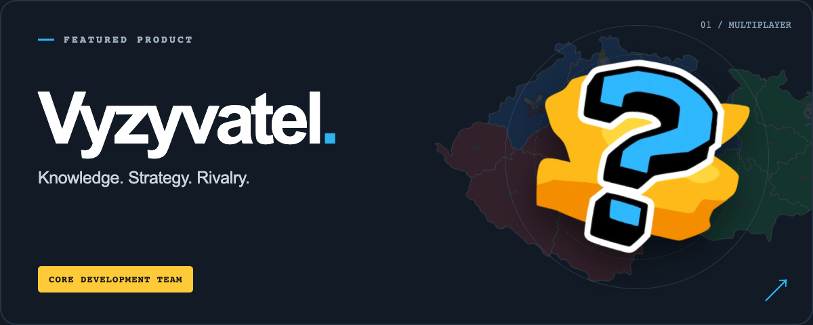

# Adam Stádník

**Full-stack developer. From idea to production.**

I build products across the full stack, with a focus on mobile apps.
React Native and Expo, backend services, web, and deployment. I’m involved from the first product decisions through launch and ongoing development.

Building at [Rustai](https://rustai.cz/), with open-source projects along the way.

&nbsp;

&nbsp;

&nbsp;

## Selected work

<a href="https://vyzyvatel.com/"><picture><source media="(max-width: 600px)" srcset="assets/vyzyvatel-feature-mobile.png" /></picture></a>

I’m part of the **core development team** behind Vyzyvatel, a community-driven multiplayer game where knowledge and strategy meet.

**[Play Vyzyvatel ↗](https://vyzyvatel.com/)**

### Open source

- **[Sveltick](https://github.com/Adam014/sveltick)** — A lightweight library for tracking performance and traffic.
- **[commit-sync](https://github.com/Adam014/commit-sync)** — GitHub and GitLab contributions in a single heatmap. The one below runs on it.

## Coding activity

My contributions across GitHub and GitLab, in one place.

Powered by <a href="https://commit-sync.vercel.app">commit-sync</a> · Bring your GitHub and GitLab contributions together.
