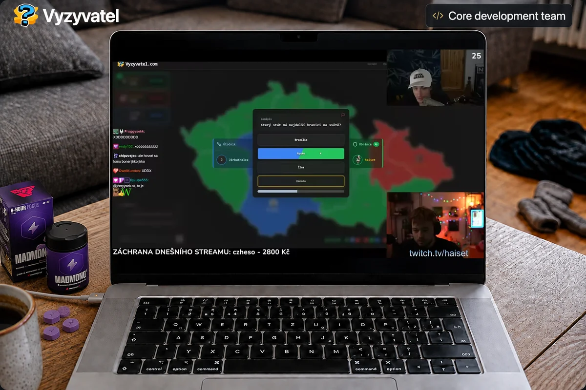

# Adam Stádník

**Full-stack developer. From idea to production.**

I build products across the full stack, with a focus on mobile apps.
React Native and Expo, backend services, web, and deployment. I’m involved from the first product decisions through launch and ongoing development.

Building at [Rustai](https://rustai.cz/), with open-source projects along the way.

&nbsp;

&nbsp;

&nbsp;

<!-- ## Selected work

<a href="https://vyzyvatel.com/"><picture><source media="(prefers-reduced-motion: reduce) and (max-width: 600px)" srcset="assets/vyzyvatel-madmonq-mobile.png" /><source media="(prefers-reduced-motion: reduce)" srcset="assets/vyzyvatel-madmonq-desktop.png" /><source media="(max-width: 600px)" srcset="assets/vyzyvatel-madmonq-mobile.webp" /></picture></a>
 Fueled by <a href="https://www.madmonq.gg/">MADMONQ</a>

I’m part of the **core development team behind Vyzyvatel**, a multiplayer quiz game where players compete for territory.

<a href="https://vyzyvatel.com/reference"><picture><source media="(prefers-color-scheme: light) and (max-width: 600px)" srcset="assets/vyzyvatel-reach-light-mobile.svg" /><source media="(max-width: 600px)" srcset="assets/vyzyvatel-reach-dark-mobile.svg" /><source media="(prefers-color-scheme: light)" srcset="assets/vyzyvatel-reach-light.svg" /></picture></a>

**[Play Vyzyvatel ↗](https://vyzyvatel.com/)** &nbsp; · &nbsp; [Videos & press ↗](https://vyzyvatel.com/reference)

Gameplay clip: <a href="https://www.youtube.com/watch?v=_pdJ2xdY19g&amp;t=336s">HaiseT+ ↗</a>

--- -->

### Developed 

- **[Vyzyvatel](https://vyzyvatel.com/)** — Multiplayer quiz game where players compete for territory.
**[Play Vyzyvatel ↗](https://vyzyvatel.com/)** &nbsp; · &nbsp; [Videos & press ↗](https://vyzyvatel.com/reference)

### Open source tools

- **[ADB Ready](https://github.com/Adam014/adb-ready)** — An MCP-native, local-first CLI that gives agents and developers safe, typed control of Android targets, apps, UI, logs, evidence, and development sessions.
- **[Sveltick](https://github.com/Adam014/sveltick)** — A lightweight library for tracking performance and traffic.
- **[commit-sync](https://github.com/Adam014/commit-sync)** — GitHub and GitLab contributions in a single heatmap. The one below runs on it.

## Coding activity

My contributions across GitHub and GitLab, in one place.

Powered by <a href="https://commit-sync.vercel.app">commit-sync</a> · Bring your GitHub and GitLab contributions together.
